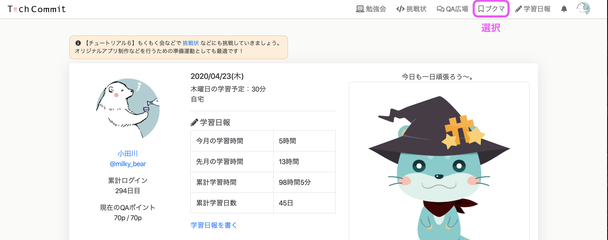
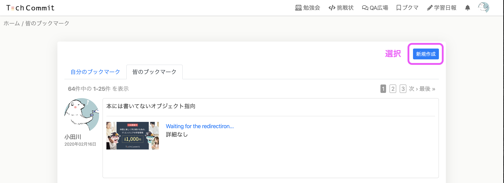
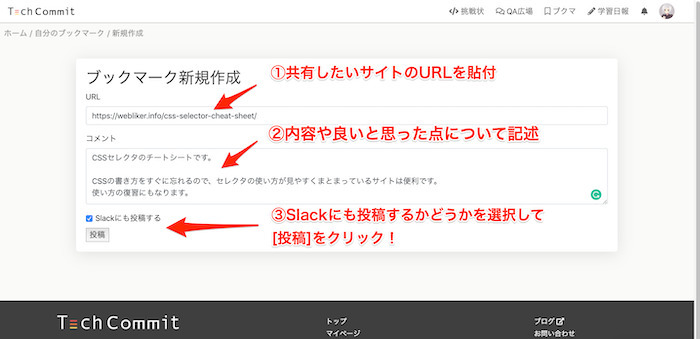
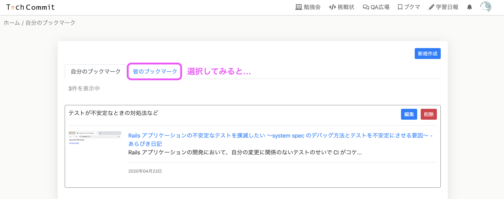
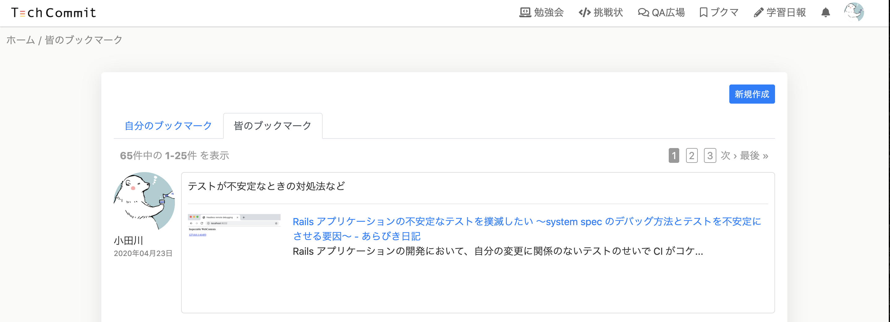
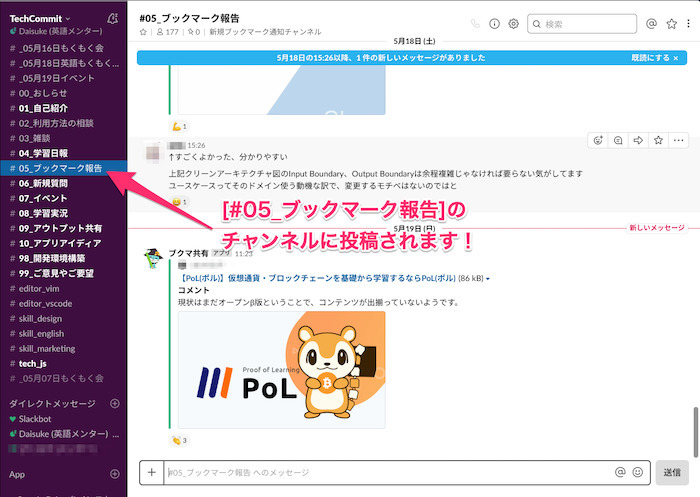

## ブックマーク共有機能とは？
ブックマークの共有機能（ブクマ）とは、みなさんが便利だと思ったウェブサイトをクリップして、それを他のメンバーと共有できる機能です。

ポートフォリオ機能などで自分が過去に「何に興味を持ったのか」や「どんな問題を解決したのか」というPRにもつながるので、コレはすごく良い学びになったな！と思ってものは積極的にブックマークしてみましょう。

## ブックマーク共有の方法
ブックマーク共有機能へは、トップページ右上のグローバルメニューの[ブクマ]から行くことができます。

[ブクマ]を選択すると「皆のブックマーク」という画面が表示されます。

新規ブックマークを作成するには、[新規作成]を選択してください。  
ブックマーク新規作成画面に遷移します。

ブックマーク新規作成画面では、URL欄、コメント欄、Slackへの投稿設定があります。

共有したいページのURLを貼り、内容や便利だと思った理由などを簡潔に記述してください。

Slackチャンネルの「ブックマーク報告」で共有したい場合は、「Slackにも投稿する」というチェックボックスにチェックをお願いします。

[投稿] をクリックすると、ブックマークが作成・共有され「自分のブックマーク」へ移動します。

[皆のブックマーク]リンクをクリックして、自分のブックマークがどう表示されているか確認してみましょう。

「皆のブックマーク」を確認すると、自分のブックマークが共有されているのがわかりますね。

なお、 「Slackにも投稿」にチェックを入れた場合は、Slackの「ブックマーク報告」チャンネルにも同時投稿されます。

ぜひ同時投稿して、便利なサイトをみなさんで共有していきましょう！
