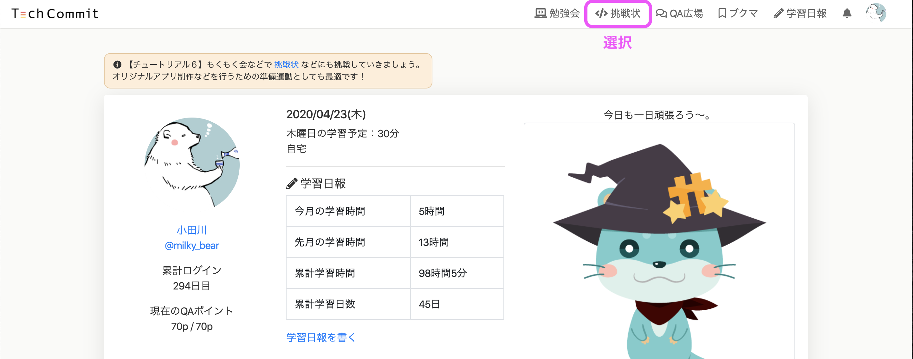
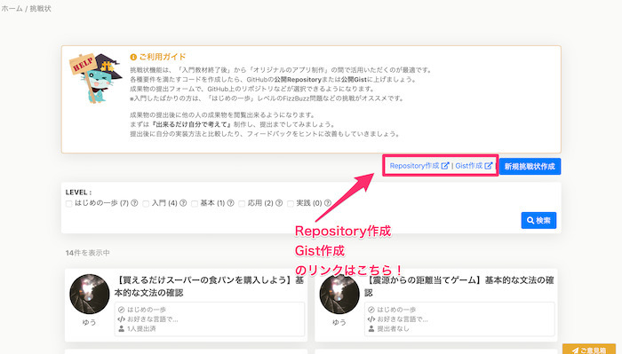
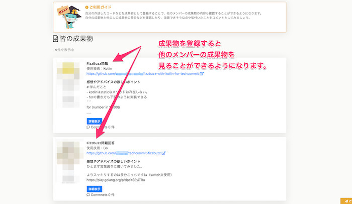

## 挑戦状とは
挑戦状とは、実際にコードを書いてみる課題のことです。

それぞれの挑戦状には要件が設定してあります。  
要件を満たしたコードを書いて提出してください。  
成果物の提出後に、他の人の成果物を閲覧出来るようになります。

まずは出来るだけ自分で考えて制作し、提出してみましょう。

また、提出後に自分の成果物と他のメンバーの成果物を比較し、実装方法の違いなどを見てみましょう。

フィードバックがあった場合はそれをヒントに改善していきましょう！

## 挑戦状の狙いと有効な使い方
挑戦状の課題は特に「新しい学習中の技術で入門書などを終えてから、オリジナルアプリを作成するまでの間」に使用することを想定して提供しています。

入門系の技術書などでは基本的に書いてあることをなぞるインプットが中心で、その後に蓄積した知識を、自分で考えた仕様を実現するロジックとして表現するまでには、一段階大きな壁があります。

まずは小さなものから『要件を満たすように』自分で考えてコードを書くという行為に慣れることで、実際に『ものづくりをしていく』という感覚を掴んでいけるようになります。

### 挑戦状の登録

挑戦状はグローバルメニューの一番左側にあります。

グローバルメニューから挑戦状のページへ進むと、挑戦状一覧が表示されます。  
挑戦してみようと思うものをクリックしてください。

各挑戦状を選択すると、[成果物の登録]というボタンが表示されます。

[設定]メニューの[外部サービス連携]でGitHub連携が済んでいる方はそのまま登録画面に進みますが、GitHub連携が済んでいない場合は、連携画面へと遷移します。

▼GitHub連携画面

[GitHub連携]をクリックして連携ができたら、再び挑戦状画面に戻ってください。

また、成果物の提出にはコードを載せたRepositoryもしくはGistを登録する必要があります。  
登録する前に、RepositoryもしくはGistを作成し、コードを載せておいてください。

挑戦状一覧ページの右上メニューに作成リンクがあります。こちらもご活用ください。

GitHub連携が完了している場合、各挑戦状で[成果物の登録]をクリックすると、成果物の登録フォームが表示されます。  
挑戦状に対応するコードを載せたRepositoryもしくはGistを選択してください。

また、タイトル・使用技術・工夫した点などを入力し、「コメントやアドバイスの受付可否」でコメントを受け付けるかどうかを選んでください。

成果物を登録すると、他のメンバーの成果物を見ることができるようになります。  
他のメンバーの書いたコードとの差分を見ながら理解を深めましょう。

## 挑戦状の作成（準備中）
また、現在のところ挑戦状を作成できるのはTechCommitの運営メンバーだけとなっておりますが、今後はメンバー同士が挑戦状を出しあえる機能を実装していく予定です。

ぜひ学んだ技術をアウトプットしていきましょう！
