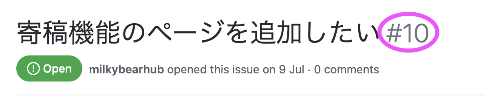

# How to contribute
TechCommitではコントリビューションをお待ちしています。

- バグ・誤字などの報告  
- 機能追加などの提案・要望  
- ドキュメントの追加  

など

## バグ・誤字などの報告、提案・要望等
[Issue](https://github.com/tech-training/tech-commit-doc/issues)にてご報告頂けると幸いです。

## ドキュメントを追加・修正する
1. Issueを確認します。  
2. このレポジトリをforkし、新たにブランチを切ってドキュメントを追加・修正します。  
3. Issueを元にPullRequest（以下PR）を作成し、マージ先のブランチが**master**になっていることを確認してください。 
4. TechCommit運営メンバーがレビュー・マージします。

### ブランチ名
ブランチ名は追加・修正する内容に沿った命名をしてください。    
例：  

- add-description-zoom-install  
- fix-learning-report-page-typo

### Pull requestの作成
close #△△ をつけてください。△△はIssueの番号です。  
これをつけることでPRがマージされた時、該当するIssueはcloseされます。  

▼ Issue番号はIssueの題名の右側に表示される番号のことです。  

