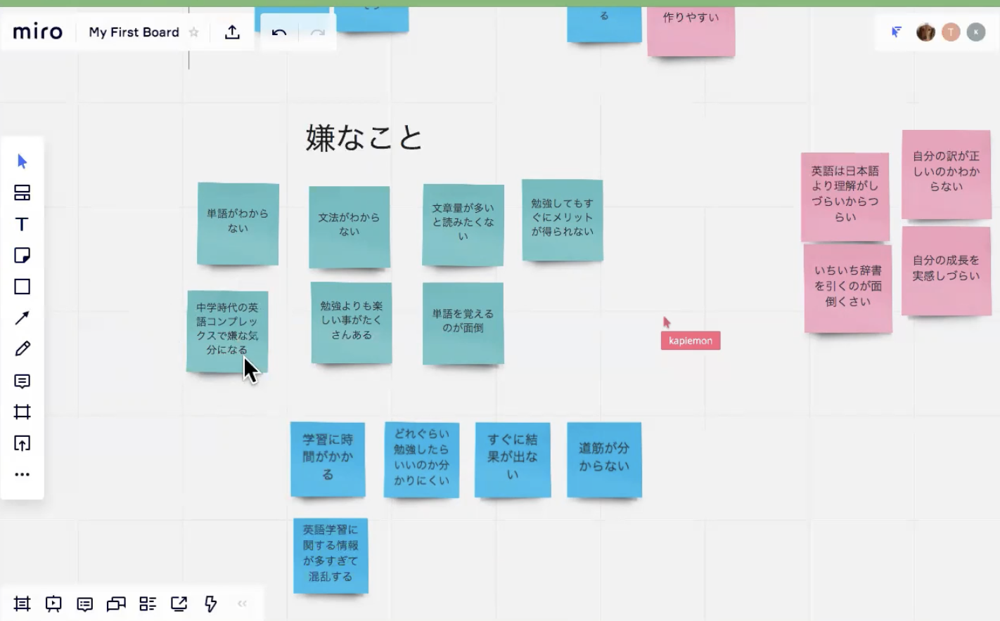
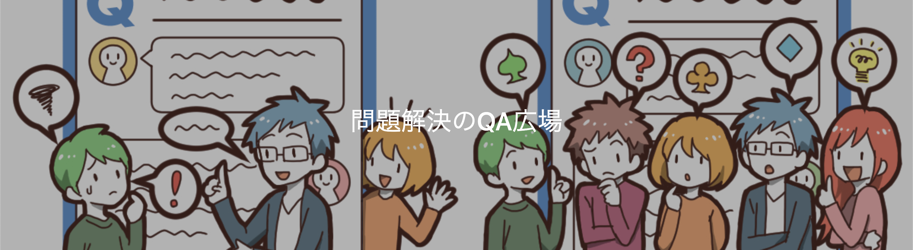

このページでは、個人アプリ開発を目指して学習したい人に向けて、TechCommitの活用法をお伝えします。 

## 何から始めたらいいのか分からない・アイデアが浮かんでこない
「何から始めたらいいの？」「ぜんぜんアイデアが浮かんでこない」という人は以下の勉強会アーカイブ動画を参考にしてみてください。  

▶ [オリジナル個人アプリ作成勉強会 - 前編 ※アイディア出し＆企画から開発まで](https://www.tech-commit.jp/main/event_archives/2)   
▶ [オリジナル個人アプリ作成勉強会 - 後編 ※開発＆運用から集客まで](https://www.tech-commit.jp/main/event_archives/7)

### プチプロジェクトシリーズでイメージを掴もう

 
 

個人アプリ開発の一通りの流れを講義＆ワークショップ形式で開催した**プチプロジェクトシリーズ**もあります。  
実際にアイデア出しからコーディングまで実際にやっているところを観られますので、個人アプリ開発の流れの全体像を掴みたい人は視聴してみてください。

1. [プチプロジェクト開発1@アイデアソン＆企画体験会](https://www.tech-commit.jp/main/event_archives/62)  
2. [プチプロジェクト開発2@ページ構成とER図体験](https://www.tech-commit.jp/main/event_archives/63)
3. [プチプロジェクト開発3＠UIUX改善Tips体験会](https://www.tech-commit.jp/main/event_archives/64)
4. [プチプロジェクト開発4＠Railsでの実装モブプログラミング会](https://www.tech-commit.jp/main/event_archives/67)
5. [プチプロジェクト開発5＠Herokuでのインフラ＆公開設定会](https://www.tech-commit.jp/main/event_archives/68)

## 他のメンバーがどのように開発しているのか参考にしたい
他のメンバーがどのような順序や方法で個人アプリを開発しているのか参考にしたいのであれば、
TechCommit Noteの**[個人アプリ開発インタビューマガジン](https://note.com/tech_commit/m/mfe8deb8dc646)**を見てみましょう。

## 設計や開発で詰まって進捗が出せなくなってしまった
やることは決まってさあ取り掛かろう！あれ？これってどうすればいいんだ？💦訳のわからないエラーが出てしまった💦  
という人は他のメンバーに助けを求めましょう。  

確かに一人で考えることは大切ですが、全く進捗が出なくなってしまうと精神的に辛くなってしまいます。  
ある程度まで考えたり調べてダメならスッパリ諦めましょう。 

質問は[QA広場](https://www.tech-commit.jp/main/questions)を使うと、内容をMarkdown形式で書けたり、後で学習記録として見返すこともできます。  

### 環境構築で詰まったら
Slackの[#開発環境構築](https://techcommit.slack.com/archives/CJC1AFPLM)チャンネルで助けを求めましょう。  
質問するときは以下を質問内容に含めると回答がもらいやすくなります。  

- 現状の利用環境（Mac/Windowsなど）
- 学習している内容や利用技術
- 参考にしている教材やそこに書いてあること
- 振る舞いとして期待していること
- 期待と違って「事実ベース」で現在起きていること（ターミナルのログやスクリーンショットを添付しましょう）

もちろん[QA広場](https://www.tech-commit.jp/main/questions)で質問しても大丈夫です。  

### 個人アプリの開発相談・進捗共有会に参加しよう

直接相談、あるいはみんなに意見を聞きたいという場合は、毎月第1日曜日16時からZoomで開催している**個人アプリの開発相談・進捗共有会**で相談してみましょう。

**▼ 参加メンバーの声**  
>・モチベーションが上がる、お互いに共有できて楽しい。  
>・自分の考えや悩んでることが話すことで明確化する、他の方の進捗を聞くことでアイデアも活発になる。  
>・自分が次に何をすれば良いか「ToDo」レベルに落とし込めたところが良かったです。  

[勉強会アーカイブ](https://www.tech-commit.jp/main/event_archives)に、過去に開催された会の動画がアップロードされているので、雰囲気を知りたい人は「個人アプリの開発相談」で検索してみてください。  
