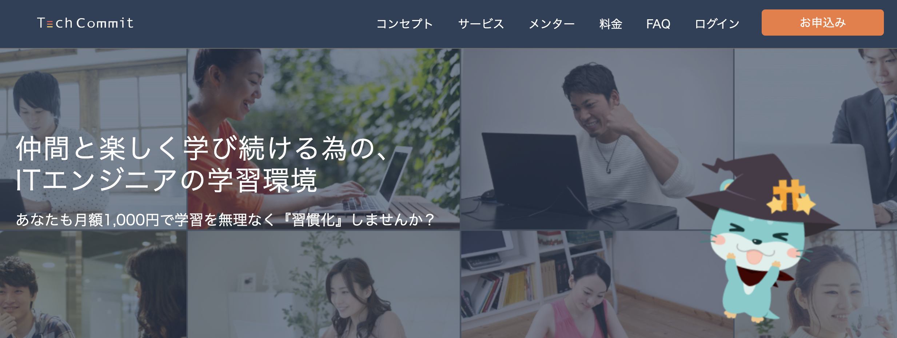
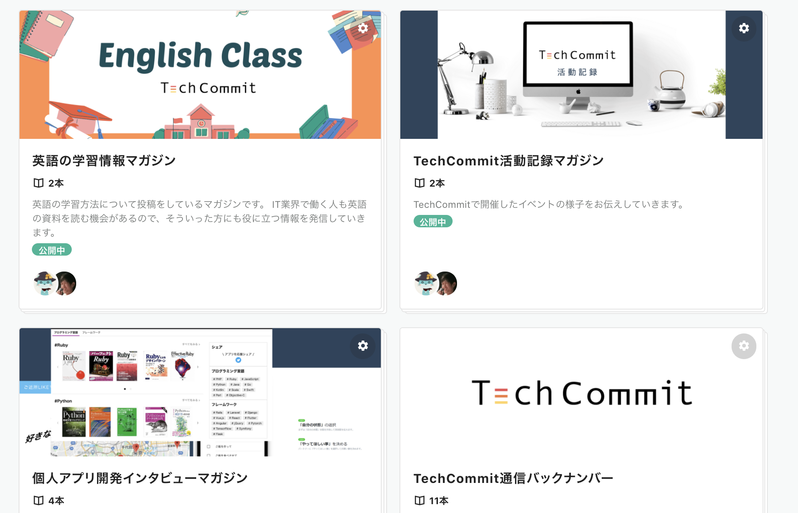

# TechCommitドキュメントサイトにようこそ！

このサイトはコミュニティ型IT学習環境「[TechCommit](https://www.tech-commit.jp/)」を最大限活用するために、
**機能概要**をまとめています。  
今後は具体的なプログラミングの**学習段階に応じた活用例**などもまとめていく予定です。

TechCommitを100%活用して、プログラミング学習を楽しく効果的に**継続して**いきましょう！

## TechCommitのコンセプト
TechCommitはオンラインで**学びを遊ぶ、ITスキルの継続的学習環境**をコンセプトとしてサービスを開発・運用しています。  
地方在住や学生の方でもイベントやSlackでのコミュニケーションなどを通じて、**仲間と楽しく継続的に学習して結果を出していく為**にご活用下さい。

## 本サイトの見方(メンバー向け)
### ツールの準備が済んでいない場合
TechCommitではWebサイト以外にもSlack（チャットツール）とZoom（ビデオ通話ツール）を使用してメンバーとコミュニケーションをとっています。  
SlackとZoomの導入について確認しておきましょう。

▶ [利用環境を整えよう](tutorial/preparation.md)  
▶ [興味のある話題に参加しよう](tutorial/join-slack-channel.md)  

### TechCommitの各機能の概要
TechCommitサイトにある機能についてご紹介します。各機能の詳細はリンクをご覧ください。

| 機能 | 概要 |
| -----------| ----------- |
| [学習日報](learning-report.md) | 学習内容を記録する機能です。学習日報をつけると学習時間がグラフとして見える化できるなどメリットがあります。 |
| [QA広場](qa-board.md) | 質問掲示板です。学習で詰まってしまったら質問してみましょう。 未解決の質問があったら助けてあげましょう。 |
| [挑戦状](challenge.md) | 課題に対して自分でコードを書いて提出する機能です。コードを書く力試しに利用しましょう。 成果物の提出後に、他の人の成果物を閲覧できるようになります。 |
| [ブックマーク](bookmark.md) | 「役に立った！」と思ったサイトを保存してメンバーと共有できる機能です。 ブックマークしたページを[ポートフォリオページ](https://www.tech-commit.jp/your/portfolios)で一覧できます。 |

サービスの利用方法等がわからない場合は、Slack内の[#02_利用方法の相談](https://techcommit.slack.com/archives/CJU6KST7H)チャンネルにてご質問ください。  
TechCommit運営メンバーが対応いたします。

## TechCommitで開催されるオンラインイベントについて
TechCommitで開催されるオンラインイベントは大きく以下の２つに大別されます。

| イベント | 概要 |
| -----------| ----------- |
| [オンラインもくもく会](mokumoku.md) | 毎日20:00~22:00に開催しているオンラインの自習室です。 学習習慣を身に付けるために利用しましょう。 |
| [週末イベント](online-event.md) | 毎週末に開催するオンラインのイベントです。交流会や講義形式の勉強会などを開催しています。 仲間を見つけたり、新しい知見を得るために参加しましょう。 |

## ソーシャルメディアの紹介

### note
[TechCommit Note](https://note.com/tech_commit)は現役ITエンジニアと駆け出しエンジニアの応援メディアです。様々な経営者やITエンジニアのキャリア観・思想をインタビューして配信したり、プログラミング学習コミュニティのTechCommit内で蓄積したITスキルに関する知見を発信しています！ 

### Twitter
 [Twitter](https://twitter.com/TechCommit)ではITに関するニュース、便利ツールの紹介、コミュニティの内で出た話題、イベント情報などを発信しています。

### Qiita
[Qiita Organization](https://qiita.com/organizations/tech-commit)に参加してTechCommitの所属メンバーとして記事を投稿できますので、  
参加をご希望される場合は、Slackの@TechCommit運営までQiita IDをDMでお送りください。  

## 本サイトの改善/修正案を受付しております
本サイトはTechCommitを最大限活用していただくために、どんどん改善していきたいと考えております。  
些細なことでも構いませんので、

- バグ・誤字修正の報告
- コンテンツ追加提案・要望

などを[Issue](https://github.com/tech-training/tech-commit-doc/issues)にてご報告いただけますと幸いです。
