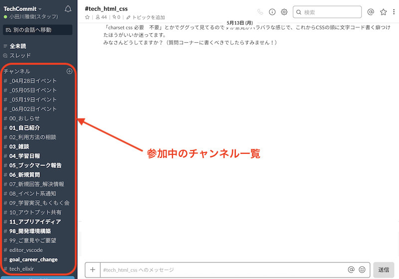
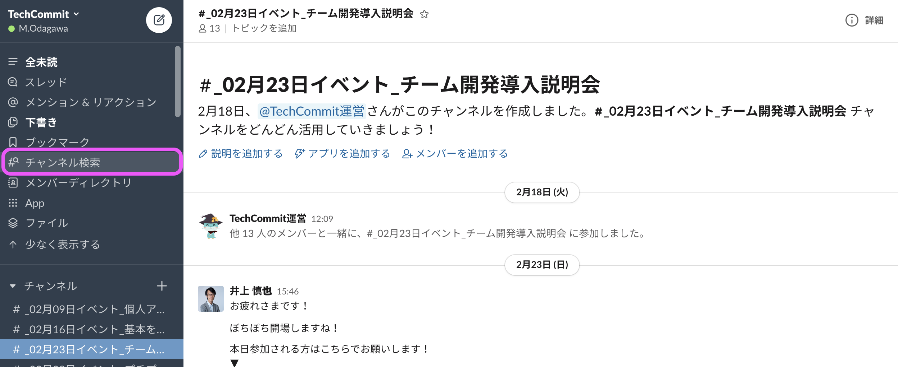
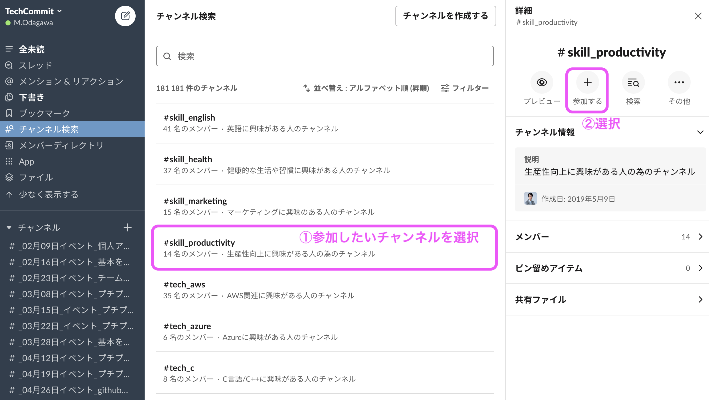
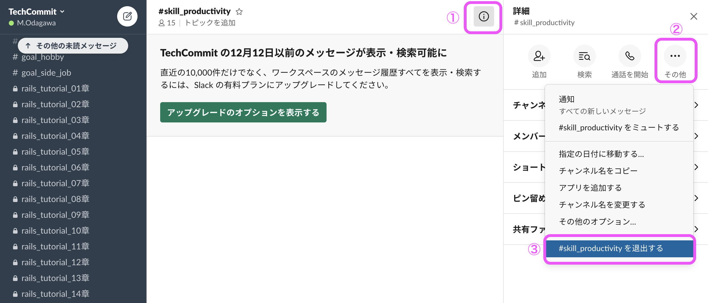

## チャンネルとは？

Slackのチャンネルとは、話題・用途別に分けられた部屋のことです。

技術の話をしたいときは例えば「技術」というチャンネルに入って話をしたり、  
趣味の話をしたければ「趣味」という部屋に入って会話を楽しみます。

Slackの左側を見ると、すでにいくつかのチャンネルに参加していると思います。

Slackのワークスペースに入ると、たとえば全体周知用などのチャンネルには自動的に参加しているかと思います。  
また、必要によっては他のメンバーに特定のチャンネルに招待されることもあるでしょう。

## チャンネルへの参加方法
チャンネルに自分から参加する方法を説明します。

左メニュー上部の[チャンネル検索]を選択してください。

※参加しているチャンネルが少ない場合、[チャンネルを追加する]というボタンがある場合もありますが、参加チャンネルが増えるとこの表示はなくなってしまいます。[チャンネル]ボタンから参加する方法に慣れておくと良いでしょう。

[チャンネル検索]を選択すると、現在参加が可能なチャンネルの一覧がでてきます。  
そこから、参加したいチャンネルを選択してください。

今回は例として生産性向上に関するチャンネル[#skill_productivity]に参加します。
チャンネルを選択し、[参加する]を選択するとチャンネルに参加することができます。

これで、参加が完了しました！  
チャンネルに参加しているメンバーと自由にやりとりを楽しんでください。

## チャンネルからの退出方法

- 間違えたチャンネルに入ってしまった
- 学習内容を変更したのでそのチャンネルにいる意味はなくなった

等の理由で、チャンネルから退出したい場合もあるかと思います。  
その場合は、以下の手順でそのチャンネルから退出することができます。

1. チャンネル上部にある**インフォメーションマーク**を選択
2. [その他]を選択
3. [チャンネル名 から退出する]を選択

また、単に通知を止めたい場合も、同メニューにある  
「#(チャンネル名)をミュートする」から、通知を止めることができます。  
通知が多くて気になる時などにお使いください。
