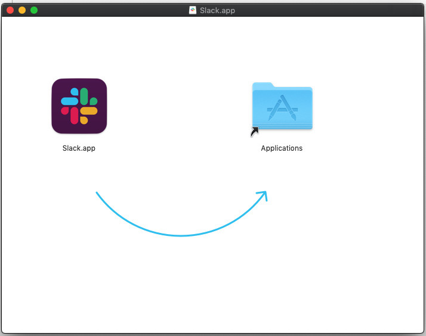
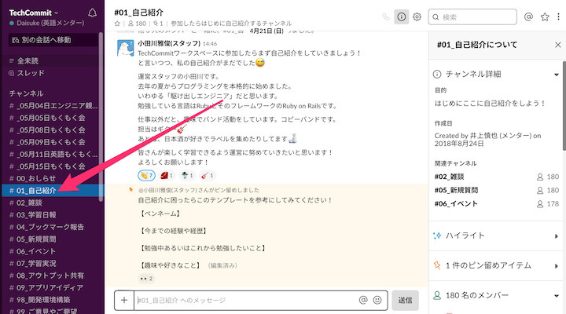
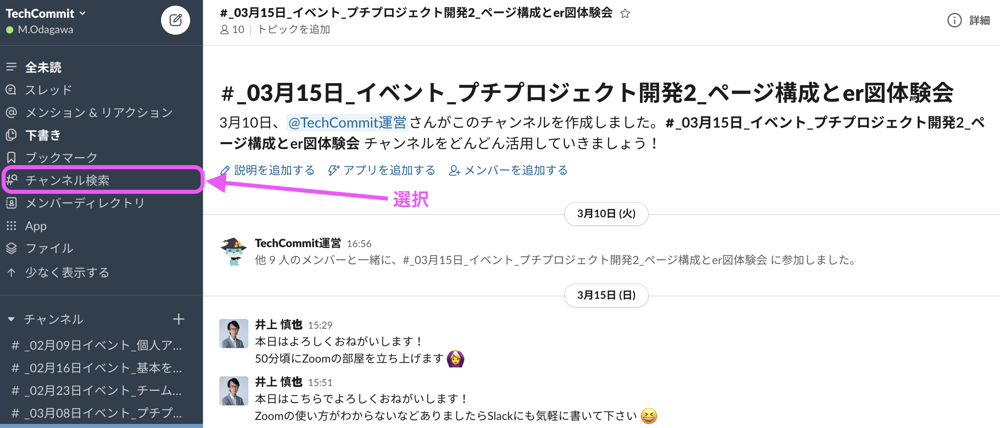
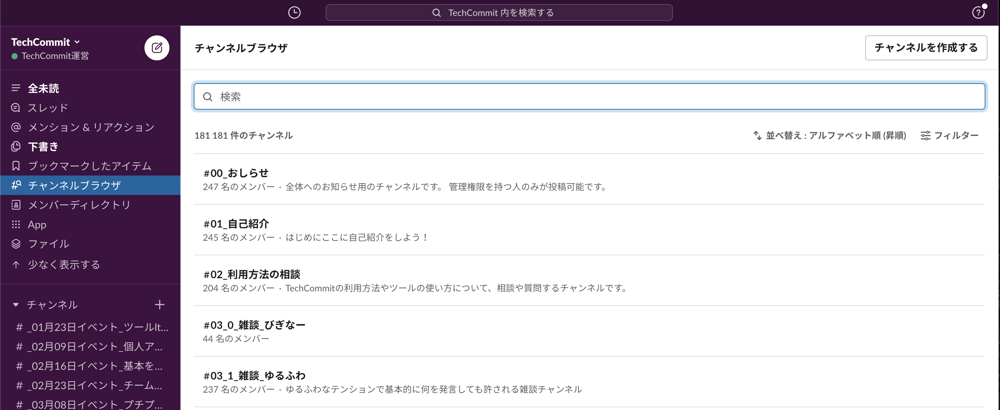

## Slackとは？

SlackはIT企業でよく使われているチャットをはじめとしたコミュニケーションツールです。IT企業で働く際には仕事で使うこともあるかもしれません。  
Slackを使うと例えば以下に挙げたように楽しく便利にコミュニケーションをとることができます。

- 絵文字を使う
- コードを見やすく投稿する
- ファイルを添付する

TechCommitでは**メンバー同士のコミュニケーションはSlackがメイン**になりますので、必ず導入しておきましょう。

## Slackのインストール方法
### パソコンの場合
[Slackのダウンロードページ](https://slack.com/intl/ja-jp/downloads/)からからダウンロードというリンクを押してください。


ダウンロードができましたら、ファイルを開いてください。  
すると、Macの方は次のような画面が出てくると思います。



矢印にしたがって、Slackをアプリケーションにドラッグします。  
これでインストールは終了です。

### iPhone、 Androidの場合
AppleStore、Playストアで[Slack]を検索して、インストールしてください。

## ワークスペースへの参加方法
次に、ワークスペースへの参加方法です。

TechCommitへの本登録を済ませると、３日以内に登録メールアドレスへSlackワークスペースへの招待メールが送られてきます。


招待メールが届きましたら、メール内にある**Join Now**または**今すぐ参加**というボタンを選択してください。
その後、氏名とパスワードを入力して**アカウントを作成する**を選択します。

これで、ワークスペースへの参加は完了です。

## 自己紹介をしましょう
SlackでTechCommitのワークスペースに参加したら、まずは自己紹介をしましょう。



まずは、サイドバーのメニューから「#01_自己紹介」というチャンネルを選択して、自己紹介をしましょう！
何を自己紹介したらいいか困った場合は下のテンプレートを使ってみてください。

---
```
テンプレート：
【今までの経験や経歴】

【勉強中あるいはこれから勉強したいこと】

【趣味や好きなこと】
```
---

同じ趣味の方、同じ言語などを学習しているメンバーを見つけて雑談したり助け合ったりしましょう！

## 興味のあるチャンネルへ参加しましょう
自己紹介が終わりましたら、次は興味があるチャンネルに参加してみましょう！



すでに「#00_おしらせ」や「#01_ 自己紹介」などの基本的なチャンネルには自動的に参加していると思いますが、そのほかにも個別の技術やツールなどに対応したチャンネルがたくさんあります。  
興味のあるチャンネルにはどんどん参加しましょう！

参加方法は、「チャンネルブラウザ」を選択するとチャンネル一覧が表示されますので、検索・選択して参加してください。



※個別のチャンネルの参加方法が分からない方は【Slackの使い方】チャンネルへの参加方法 も参照して下さい。
