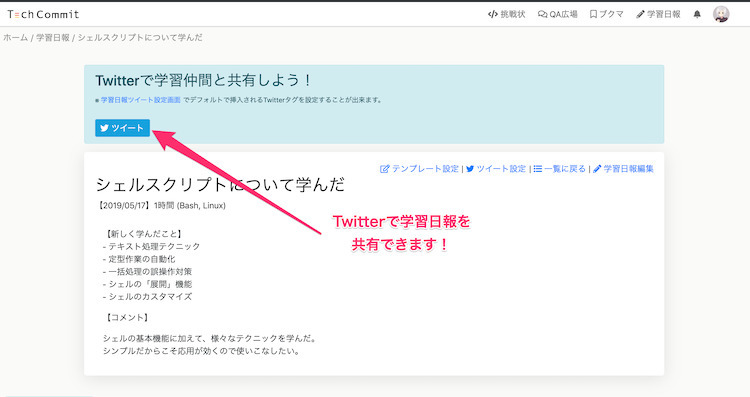
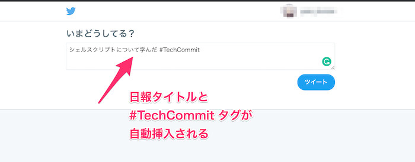
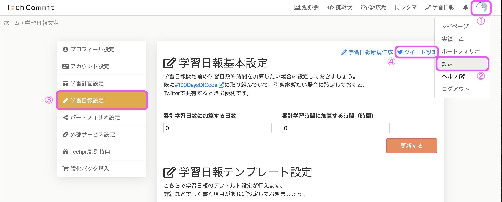
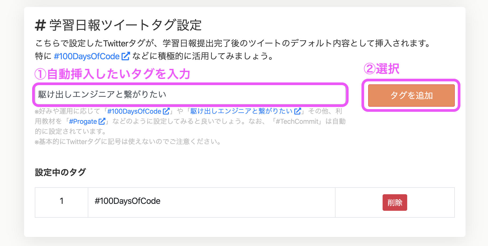
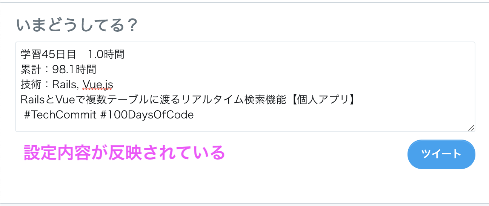

## 学習日報ツイートとは？
学習日報ツイートとは、その名の通り**学習日報をツイートする機能**です。

TechCommit上で学習日報の投稿をすると、「Twitterで学習仲間と共有しよう！」というメッセージと共に[ツイート]ボタンが出てきます。

このボタンを押すと学習内容が入力された投稿フォームが表示されます。学習日報の内容をツイートすることで、Twitterで繋がっている人に自分が何を勉強しているのかを知らせることができ、同じ技術などを学ぶ仲間を探すこともできるでしょう。

なお、ツイートに自動入力される項目は、初期設定では学習日報のタイトルと#TechCommitというタグのみとなっています。

ここに情報を自ら付け加えてツイートしても良いですが、[学習日報ツイート設定]で自動挿入される項目を設定することができます。

## 学習日報ツイート設定
デフォルトの設定だと学習日報のタイトルと#TechCommitというハッシュタグのみしか入力されません。これでは寂しいので、入力される項目を増やしてみましょう！**入力項目を増やすには、学習日報ツイート設定でテンプレートを設定する**必要があります。

まず、グローバルメニューの右上のアイコンをクリックし、  
[設定]→ [学習日報設定]→[ツイート設定]の順にたどってください。

ツイート設定の画面を開くと、「ツイート設定」と「#学習日報ツイートタグ設定」の項目があります。

<!-- TODO: ツイート設定の表記の説明 -->

また、学習日報ツイートタグ設定では、[#100DaysOfCode](https://twitter.com/hashtag/100DaysOfCode?src=hash) や [#駆け出しエンジニアと繋がりたい](https://twitter.com/hashtag/%E9%A7%86%E3%81%91%E5%87%BA%E3%81%97%E3%82%A8%E3%83%B3%E3%82%B8%E3%83%8B%E3%82%A2%E3%81%A8%E3%81%A4%E3%81%AA%E3%81%8C%E3%82%8A%E3%81%9F%E3%81%84?src=hash) などのタグを自由に設定することができます。

上の画像のようにツイート設定をした後に、学習日報で[ツイート]ボタンを押すと、以下のような投稿画面が表示されるようになります。

学習日報のタイトルと#TechCommitのハッシュタグのみが表示されているよりも、どのくらい勉強をしているのか、何を勉強しているのかなどについて、わかりやすくなりましたね！  
ハッシュタグをうまく使うことで、同じ技術を学ぶ仲間との繋がりも作れるでしょう。

ぜひ、学習日報をツイートで共有し、仲間を探してモチベーションを高めていきましょう！
