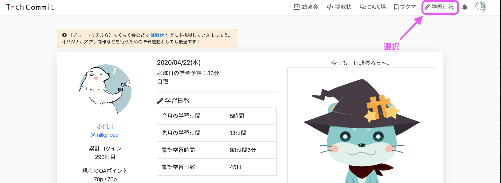
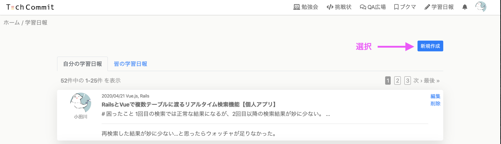
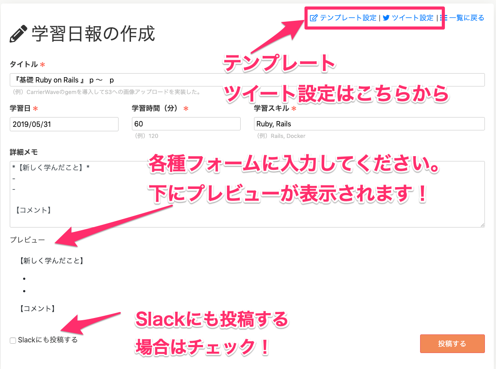
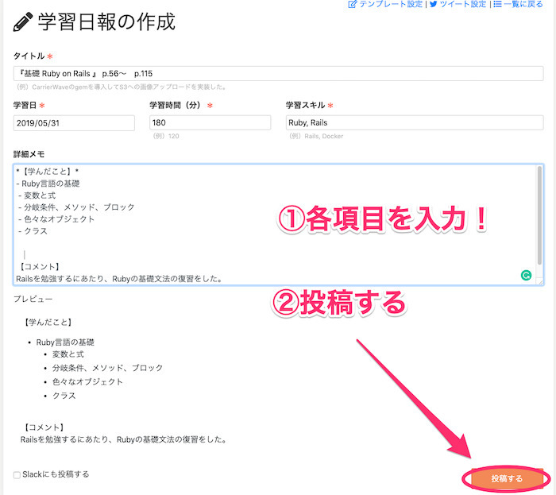
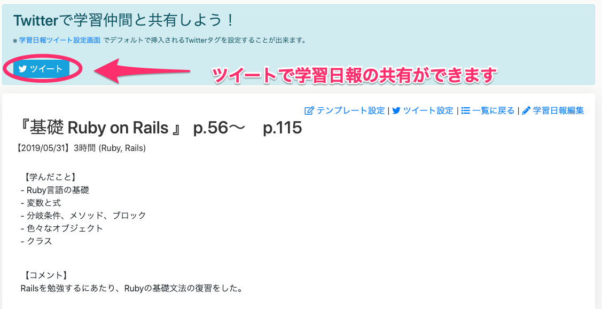
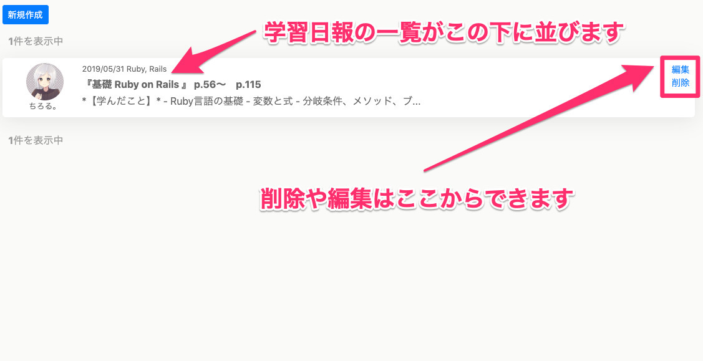
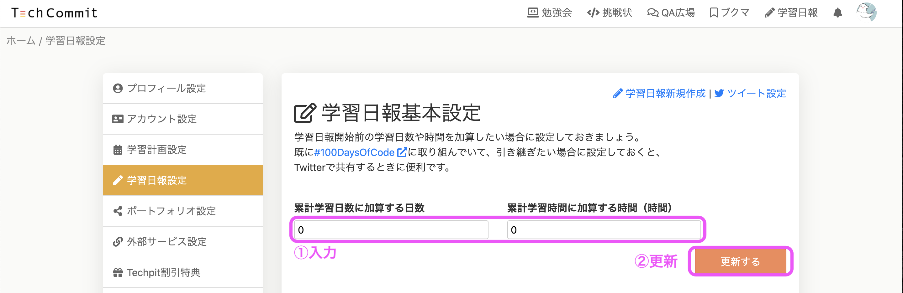
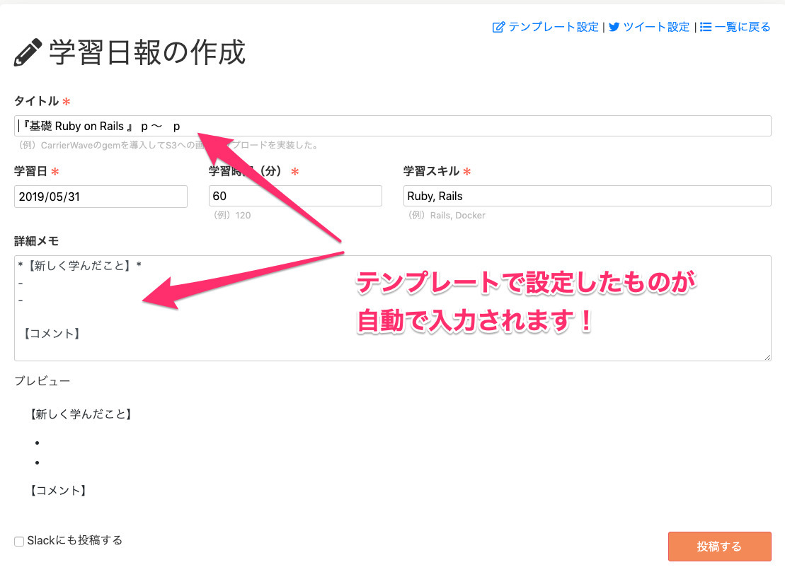

## 学習日報とは？
学習日報とは、**学習した内容を記録しておく日記のような機能**です。

学習時間、学んだ技術などを記録することができます。  
また、どのようなことを学んだかという詳細な記録をコメントで残しておくことができます。

現在は準備段階ですが、どのような技術をどのくらい学んだか集計する機能も実装予定で、**ポートフォリオの一部として活用**することができます。

## 学習日報をつけるメリットについて
学習日報をつけるメリットは、以下のようなものがあります。

- 学習内容や学習時間を可視化できる
- 学習したことへの理解度を確認することができる
- ポートフォリオの一部として使うことができる
- 同じ技術を学習している仲間を見つけることができる

学習の記録をきちんと付けている人はあまり多くありません。

学習の記録をすると、自己の成長過程を振り返ることもできますし、また、学んだことを振り返りどの程度理解したかを確認することもできます。  
時間や技術を含めて記録し続けることができれば、学習ポートフォリオとして可視化して就職や転職でも有利になるでしょう。

学習記録をつけることも学習習慣のひとつとして身につけましょう！

## 学習日報の使い方
学習日報は、マイページ上部のグローバルメニューにあります。

グローバルメニューの[学習日報]をクリックすると、学習日報の一覧ページが開きます。  
[新規作成]ボタンをクリックすることで、学習日報の新規作成ページを開くことができます。

学習日報の作成画面には入力する項目がいくつもあります。  
画像ではあらかじめタイトルなどが一部入力されていますが、これは**学習日報テンプレート設定**をすることで自動挿入されるものです。  
学習日報テンプレート設定については後ほど解説します。

学習日報作成画面の各項目に記入をしたら、右下にある[投稿する]をクリックしてください。  
その際、左下にある**Slackにも投稿する**というボックスにチェックを入れると、

TechCommitのSlack[#04_学習日報](https://techcommit.slack.com/messages/CG9CTMS6R)にも同時に投稿することができます。

## 投稿方法
まずは、先ほどの説明のとおり各種フォームへ入力をします。

詳細メモ部分にはマークダウンが使えるようになっているので、  
下に表示されるプレビューを確認しながらご活用ください。

入力しましたら、右下の[投稿する]をクリックして投稿しましょう。

学習日報が投稿されると、次のような画面に進みます。  
画面には投稿した学習日報と、学習日報のTwitter共有機能の案内が表示されます。

なお、Twitter共有機能については[こちら](learning-report-tweet.md)をご覧ください。  
投稿後に再度グローバルメニューから学習日報ページへと進むと、日報の一覧が表示されています。

削除や編集をしたい場合は、それぞれの日報の右側にある[編集][削除]から各種操作ができます。

学習日報の基本的な使い方は以上となります。  

## 学習日報基本設定について
次に、学習日報基本設定について説明します。

この機能は学習日報開始前の学習日数や時間を加算したい場合に設定しておくもので、必須ではありません。    
既に[#100DaysOfCode](https://twitter.com/search?q=%23100DaysOfCode&src=typeahead_click)に取り組んでいて引き継ぎたい場合に設定しておくと、Twitterで共有するときに便利です。

## 学習日報テンプレート設定について
学習日報テンプレートは、学習日報（日々の勉強の記録）を書く際に適用されるテンプレートです。これを設定しないでも学習日報を書くことはできますが、同じことを続けて学んでいる場合や、書き方を統一したい場合はテンプレートを設定すると便利です。

学習日報テンプレートの設定をするには、グローバルメニュー右上のアイコンをクリック→ [設定]をクリックしてください。

移動先のページ左側に各種設定用メニューがあります。メニューの [学習日報設定] をクリックしてください。

「学習日報テンプレート設定」というページが出てきますので、上の画像を参考にしながらテンプレートとして設定したいことを入力してください。

ここでテンプレートの設定をすると、新規の学習日報を作成する際に、設定したものが自動挿入されるようになります。なお、テンプレートにもマークダウンが利用可能になっていますのでご活用ください。

記入しましたら、右下の [更新する] をクリックして更新をしてください。

画像のようにテンプレートを設定しますと、新規の学習日報作成の際に設定した項目が自動で入力されます。

これで、学習日報テンプレートの設定ができました。

また、先ほど軽く触れましたがTwitter共有機能についてもテンプレートを設定することができます。  
詳しくは[学習日報ツイート設定](learning-report-tweet.md)を参照してください。

日々の学習を記録し、自己の成長や就職・転職に役立てましょう！
