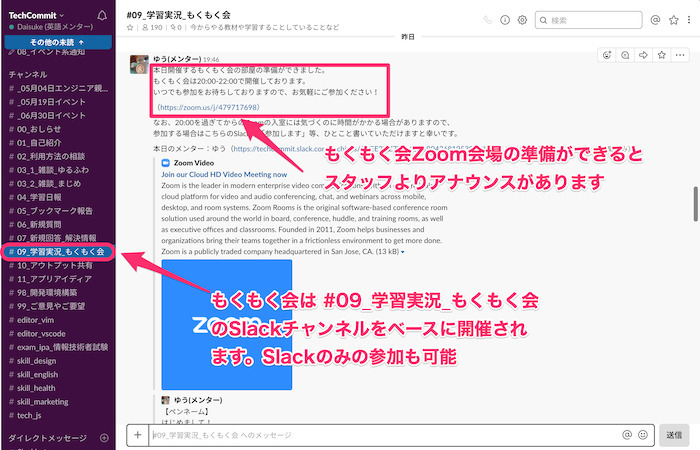
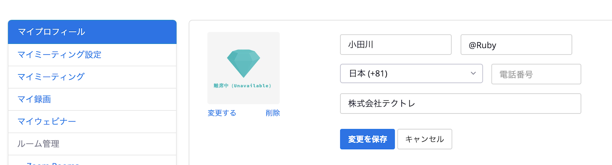

TechCommitでは毎日オンラインもくもく会を開催していますが、  
存在を知らない、もしくはまだ参加したことがない方がたくさんいらっしゃると思います。

## もくもく会とは？
IT業界の勉強会でよく聞く「もくもく会」ですが、馴染みのない方もいるでしょう。  
一言でいえば、もくもく会とは「**自習型の勉強会**」を総称した呼び方です。

一般的に、各自で学習したい内容や教材を持ち込んで学習を進める、いわば学習塾等にある自習室のようなものです。  
技術的なテーマを決めている場合もあれば自由に実施する場合もあります。

## TechCommitのオンラインもくもく会の活用法
TechCommitでは**毎日20時からもくもく会を開催**しています。  
TechCommitのSlackに参加済の方は誰でも参加できますので、**学習習慣を身に付ける**ためにご利用下さい。

仕事で忙しい方などは**曜日を決めてGoogleカレンダーに予定として投入しておく**と良いでしょう。

もくもく会にはスタッフが常駐しています。
もくもく会中に**分からないことがあれば同じ分野を学習している仲間やメンターにも相談してみましょう**。

## もくもく会で解決した質問
- コードを書いていてエラーの原因が分からなかったが、仲間やメンターに教えてもらって解決できた。
- 教材に書いてある内容の意味がよく分からなかったが、同じ教材を使って学習していた仲間がいて教えてもらえた。
- 自分に合った教材を紹介してもらえた。
- 学習方針について相談に乗ってもらえた。

## 英語もくもく会
毎日開催しているもくもく会のうち、**毎週土曜日を「英語もくもく会」**としています。  
**週に１度は英語に触れる機会を持って欲しい**という思いで開催しています。  

なぜなら、エンジニアとしてのスキルを向上させるためには英語は避けられないからです。  
プログラミングのエラーメッセージはほとんどが英語ですし、英語で書かれたドキュメントしか存在しない場合もあります。

また、検索するときも英語で書かれた情報を理解できれば、多くの情報に触れることができるので、英語のスキルは問題解決の手助けになります。

参加者の中には、中学生の英語から学び直している人、英語で書かれたプログラミング教材に取り組む人もいます。

何を使ってどのように学習すればいいのか分からない場合は、まずはメンター相談してみましょう。

▼下の記事もぜひ参考にしてください。  
[ITエンジニアのための英語学習メディアまとめ](https://www.tech-training.jp/blog/entries/3)

### 英語もくもく会で解決した質問
- 文章の意味が分からず解説してもらって理解できた。
- 英語の聞き取りのコツを聞いてみたら、音がどのように繋がったり欠落したりするかの法則を知ると良いと教えてもらえた。
- どんなツールを使うと良いか聞いたら、ポップアップ辞書ツールを勧めてもらった。
- 自分のレベルにあった勉強法や教材を教えてもらえた。

ぜひ、この機会に技術だけではなく英語の学習習慣を身に付けていきましょう。

とはいえ、英語ではなく技術の学習をしたい方もいらっしゃると思うので、必ずしも英語の勉強でなくても参加して構いません。  
ただし、**英語に強みのあるメンターが担当します**のでご了承ください。

## もくもく会の疑問
オンラインもくもく会について解説しましたが、初めて参加する方にとっては、実態が分からず不安に思うかもしれません。

よくありそうな疑問についてお答えしてみました。

#### Q. ビデオ通話だから顔を出していないとダメ？
#### A. 音声のみ、Slackのみ参加も可能です。

実際に音声のみで参加されている方がいらっしゃいますが、ビデオ通話の方と同様にコミュニケーションをとることができます。

映像の切り替え方などZoomの使い方については[Zoomのインストール方法と基本的な使い方](install-zoom.md)も参照ください。

#### Q. マイクがないとダメ？
#### A. テキスト（Slack）のみの参加も可能です。
1. Zoomに参加して自習室のような雰囲気を体感しながらSlackだけでコミュニケーションをとる。
2. Zoomに参加しないでSlackだけでコミュニケーションをとりながら同じ時間を共有して学習する。

どちらも歓迎しますので、ご自身のスタイルに合わせてご参加ください。

#### Q. プライベートな音を入れたくないのですが。
#### A. Zoomはミュート機能があり、自分の音声を聞かれたくない場合は音声をオフにすることができます。

Slackのチャットでもコミュニケーションを取っているため、Zoomの音声は終始オフにしたままでも問題ありません。

#### Q. どれくらいの人数が参加するの？雰囲気は？
#### A. 曜日にもよりますが３人〜１０名程度です。

集中してもくもくと学習する方、たまに雑談される方、それぞれいらっしゃいます。  
人数が増えた場合は、取り組んでいる技術などで部屋を分けることがあります。

#### Q. 学習で対応している技術は？
#### A. 基本的には「自習室」という扱いのため、どんな技術の学習をされても問題ありません。

メンターにも得意分野がありますが、特定の分野の得意なメンターが参加する日に参加すると問題解決などは行いやすいでしょう。

## 参加の流れ
オンラインもくもく会の参加の流れについて解説します。
### Slackのもくもく会チャンネルに参加する
まずは、自分がSlack「**#09_学習実況_もくもく会**」に参加しているか確認してみてください。
チャンネルの検索方法は[Slackチャンネルの参加方法](join-slack-channel.md)を参考にしてください。

入室などの案内は毎回「**#09_学習実況_もくもく会**」で行いますので、利用する場合は参加しておきましょう。

### 開催場所を確認する
もくもく会の開催はZoomというオンラインミーティングツールで行います。
Zoomの準備がまだできていない方は[Zoomのインストール方法と基本的な使い方](install-zoom.md)を参考にしてください。

もくもく会の準備が整うと **#09学習実況_もくもく会**チャンネルに、開催する部屋のURLともくもく会開始のアナウンスが流れます。

### Zoomのマイプロフィールを設定する
もくもく会では基本的にZoom上の名前を**Slack上の表示名**と合わせていただくようお願いしています。

名前を固定で設定したり、アイコン等各種設定をする場合にはZoomのマイプロフィールのページから変更できます。  
会員登録をしなくてもZoom自体は利用可能ですが、その場合はZoom入室後変更いただけますと幸いです。

なお、入室後でも変更可能なので、使い方に慣れてきたらマイプロフィール上でデフォルトの表示名を設定しておいて、入室したら適宜変更することもできます。
