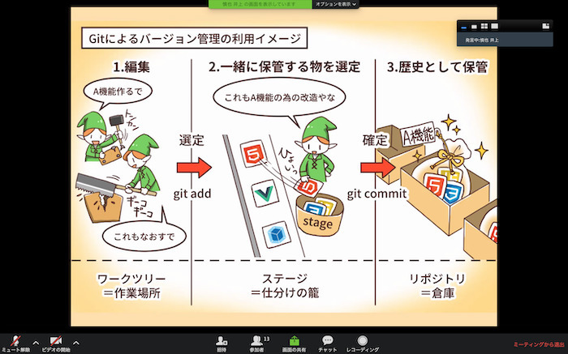
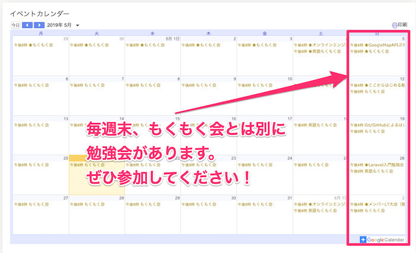

## 週末勉強会とは
週末勉強会とは、毎週末に開催しているオンラインのIT勉強会のことです。

ゲストを招いての講義やLT、ハッカソンの開催など様々な内容で実施しています。
アンケートの結果などを元に勉強会を行っています。

地方の方でも気軽にオンラインで参加して、「**現役のITエンジニアの方に直接質問なども出来る機会**」を提供し、新たな知見を得てスキルアップしていただく他、刺激を得て学習のモチベーションを上げることにも繋げてもらおうという狙いで実施しています。

勉強会は、Zoomの画面共有機能等を活用しながらオンラインで進めていきます。

Zoomの使い方については、[Zoomのインストール方法と基本的な使い方](install-zoom.md)をご覧ください。

▼Git勉強会の様子

Slackも交えてレクリエーションも行ったりと様々なイベントのパターンもあります。  

雰囲気が気になる方は、[オンラインもくもく会の活用方法](mokumoku.md)も参考になりますので参照してみて下さい。

## 勉強会のテーマについて
勉強会のテーマは、その時々によって異なります。
みなさんからのご意見・ご要望を参考にしながら、様々な分野の勉強会を開催していきます。

▼過去に開催したイベント（抜粋）

- ここからはじめる勉強の仕方勉強会
- Git/GitHubによるはじめてのチーム開発入門勉強会
- Laravel入門勉強会（ハンズオン）

今後どのようなイベントが行われるかについては、TechCommitサイトのマイページ下部にある、  
「Googleイベントカレンダー」から確認することができます。

また、当日はSlackの #08イベント系通知 のチャンネルでも告知します。

イベントに参加する方は、当日にSlackのイベントチャンネルに投稿されるリンクもしくは、チャンネル一覧から目的の週末勉強会のチャンネルへ参加してください。

マイクが使えない方などでも参加できるよう、基本的にSlack上のイベント用に作成したチャンネル上でもコミュニケーションを取っているため、そのイベント専用チャンネルに参加いただくようお願いしております。

## チャンネル参加方法
各イベントはTechCommitのイベントカレンダーやSlackのお知らせチャンネルで上で告知されます。  
週末勉強会ごとにSlackのチャンネルが作成されますので、勉強会が始まるまでに参加をお願いします。

チャンネルへの参加方法は[こちら](join-slack.md)を参考にしてください。

## 勉強会アーカイブ
週末はちょっと参加できないという方々や復習したい方々のために、週末勉強会を録画した動画を[こちら](https://www.tech-commit.jp/main/event_archives)にアップロードしています。

毎週金曜日に更新しています。

## 今後公開・追加予定の機能
### メンバー内での勉強会リクエストと立候補機能
外部からのゲストを招くだけでなく、TechCommitの参加メンバー間で得意分野を教え合う場にもしたいと考えています。

頑張って勉強した方や現役の方に有償で講師をお願いすることで、学習のやる気アップにも繋げていただく考えです。

勉強会の主催をしたいという方は是非提案してみて下さい。

週末勉強会は、各分野のエッセンスや「学び方を学ぶ」良い機会になるようにしていければと考えています。

様々な分野を学んで、視野を広げ、刺激を受けながらスキルアップしていきましょう！
