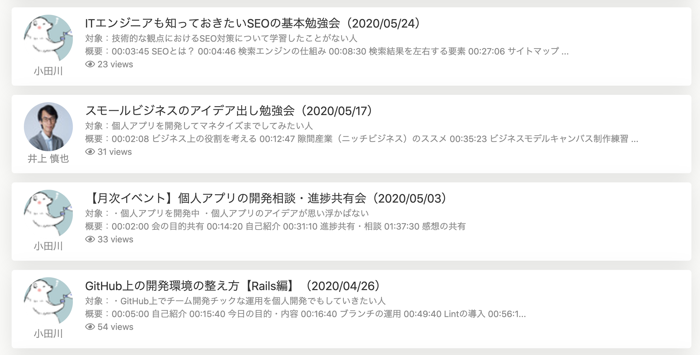

## 週末イベントとは
週末イベントとは、毎週末に開催しているオンラインのイベントです。

「個人アプリ開発相談・進捗共有会」と「交流・相談会」は毎月開催しており、  
その他ITの勉強会を開催しています。

イベントは、Zoomの画面共有機能等を活用しながらオンラインで進めていきます。  
Zoomの使い方については、[こちら](tutorial/install-zoom.md)をご覧ください。

## 週末イベントの狙い
地方の方でも気軽にオンラインで参加して、「**現役のITエンジニアの方に直接質問なども出来る機会**」を提供し、  
新たな知見を得てスキルアップしていただく他、刺激を得て学習のモチベーションを上げることにも繋げてもらおうという狙いで実施しています。

## 勉強会のテーマについて
勉強会のテーマは、その時々によって異なります。
みなさんからのご意見・ご要望を参考にしながら、様々な分野の勉強会を開催していきます。

▼例えば以下のような勉強会を過去に開催しました。   
- [GitHubを使った開発フロー【Rails編】](https://note.com/odagawa_tech/n/n3ffb695f914c)
- [基本をしっかり抑えよう Webアプリ制作者の為のSQL入門](https://note.com/tsuji_tech/n/n3cb82a652e60)

今後どのようなイベントが行われるかについては、TechCommitサイトのマイページ下部にある、  
「イベントカレンダー」から確認することができます。

マイクが使えない方に配慮して、イベント中のやりとりは専用のSlackチャンネルでも行いますので、チャンネルに参加しておいてください。  

## チャンネル参加方法
各イベントはTechCommitのイベントカレンダーやSlackのお知らせチャンネルで上で告知されます。  
週末勉強会ごとにSlackのチャンネルが作成されますので、勉強会が始まるまでに参加をお願いします。  
チャンネルは[#00_お知らせ](https://techcommit.slack.com/archives/CC8TJH6P8)チャンネルにてご連絡、もしくはイベントカレンダーの該当イベントを選択するとチャンネルのリンクが見られます。

チャンネルへの参加方法は[こちら](tutorial/join-slack.md)を参考にしてください。

## 勉強会アーカイブ
週末はちょっと参加できないという方々や復習したい方々のために、週末勉強会を録画した動画を[こちら](https://www.tech-commit.jp/main/event_archives)にアップロードしています。

## 勉強会主催者の募集
頑張って勉強した方や現役の方に有償で講師をお願いすることで、学習のやる気アップにも繋げていただく考えです。  
