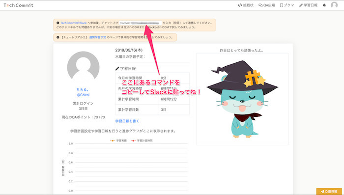
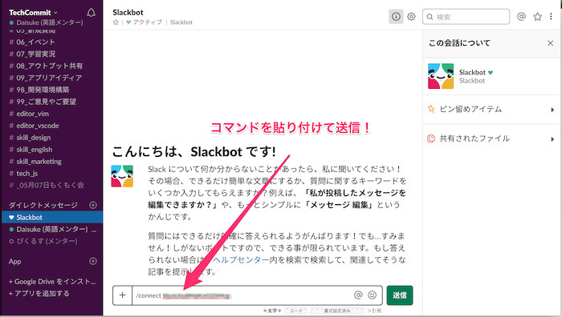
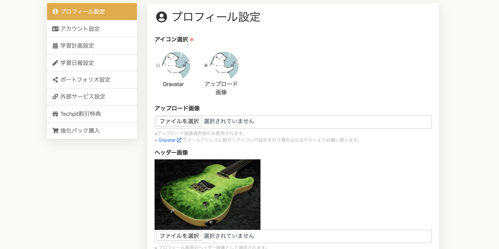
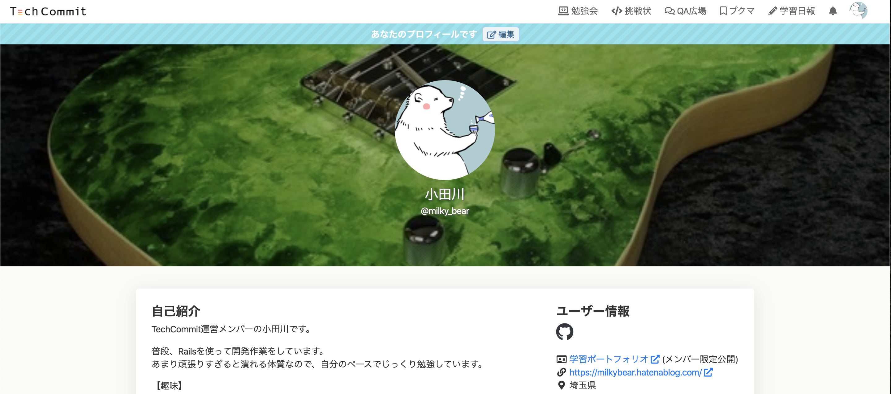
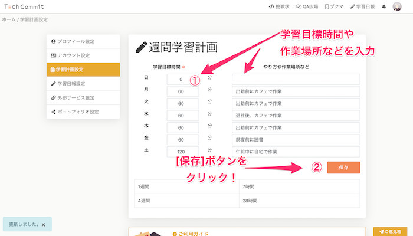
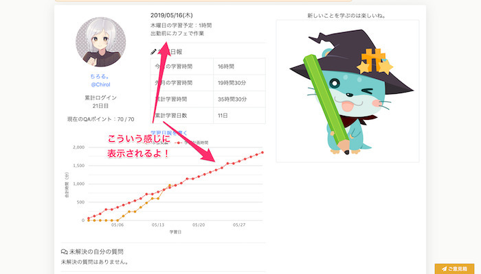

## Slackとサイトの連携
SlackとTechCommitの連携をしましょう。
これはTechCommitの機能を最大限活用するために必要となる設定ですので、**必ず連携をするようにお願いします**。

TechCommit登録後（ログイン後）にマイページを開くとSlack連携の案内が出ています。
表示されているコマンドをコピーし、TechCommitのSlackワークスペースの任意のチャンネルで送信してください。

貼り付ける場所はどこでもどこでも大丈夫ですが、心配な方はSlackBotかご自身のDMで貼り付けて送信してください。※SlackBotや自分相手に送信した場合は、実行の仕方を誤っても他の人に見えることはありません。

これで、TechCommitのSlackワークスペースを活用する準備ができました！
最後に、勉強会等で利用するZoomというビデオ通話アプリの導入をしましょう。

## プロフィールの設定
アイコンや自己紹介が設定されていると、どんな人でどんなことをしているのかがわかりやすく親しみやすくなります。

まずは自分のプロフィールを設定していきましょう！

ページ上部のグローバルメニューから、右上のアイコンをクリック→[設定]を選択してください。

以下の設定項目があります。

- アイコン
- ヘッダー画像
- 表示名
- 自己紹介
- 学習の目的
- 将来やりたいこと
- サイト／ブログ
- 活動拠点

### アイコン
アイコンはデフォルトで「Gravator」を使用しています。  
※Gravatorはメールアドレスに紐付いた画像を表示する為のサービスです。（詳しく知りたい方は[こちら](https://ja.gravatar.com/)）

自分で画像を設定したい場合は、まず「アップロード画像」の「ファイルを選択」からアイコンにしたい画像を選択しましょう。

各項目の入力が済んだら、右下の [送信] ボタンを押してください。  
画像などを設定すると、変更されたアイコンや名前がマイページに表示されます。

## 週間学習計画の設定
週間学習計画とは、「1週間にどれくらい勉強をするか」という予定です。  
習慣づけのために、**曜日ごとに平均どれくらい勉強するか**を考えて設定しましょう。  
習慣学習計画を設定することで、学習予定時間グラフが表示されます。

また、学習日報機能で実際に学習した時間と比較したグラフを見ることもできます。  
毎週・毎月きちんと学習を継続的に行うための指標として活用して下さい。

週間学習計画の設定は、マイページ右上のアイコンから [設定] をクリック、その後ページ左側メニューから [学習計画設定] を選択してください。

学習目標時間を曜日ごとに"分単位"で入力します。

右側のフォームにもやりかたや場所など入力して、出来るだけ**具体的に実際に出来る内容として**入力しましょう。

マイページで当日の予定も表示されます。

## スキルアップと学習時間の目安
だらだらと学習していても仕方ないですが、基本的に**スキルは学習量に比例**します。

スキル習得の早さは様々な要因（もともとのITリテラシー、学習へのモチベーションや集中力、学習に対する性格）によって大きく変わります。

一般的なプログラミングスクールにおいては、**120~200時間程度学習すれば本格的なアプリ開発もぼちぼち出来るようになってくる**という時間配分でカリキュラム作成をされていることもありますので参考にしてみて下さい。

仕事として開発等をしているプロのITエンジニアは月40時間、1年で480時間は最低でも経験値を稼いでいます。

1000時間程度（きちんと効率的に）学習すれば品質についてや、設計についてなどの観点も磨かれてくると思いますので、無理なく楽しく、中長期的に学習をしていくことを忘れないで下さい。

逆にきちんと楽しく学習さえ続けられれば、誰にでも出来るものではあります。
