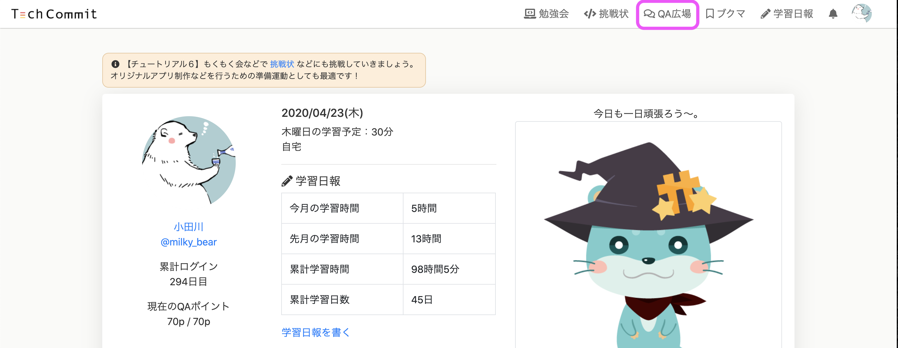
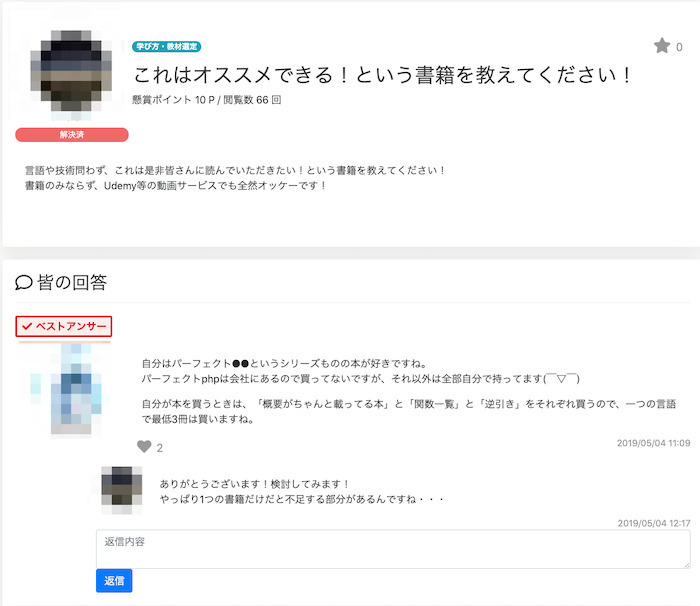
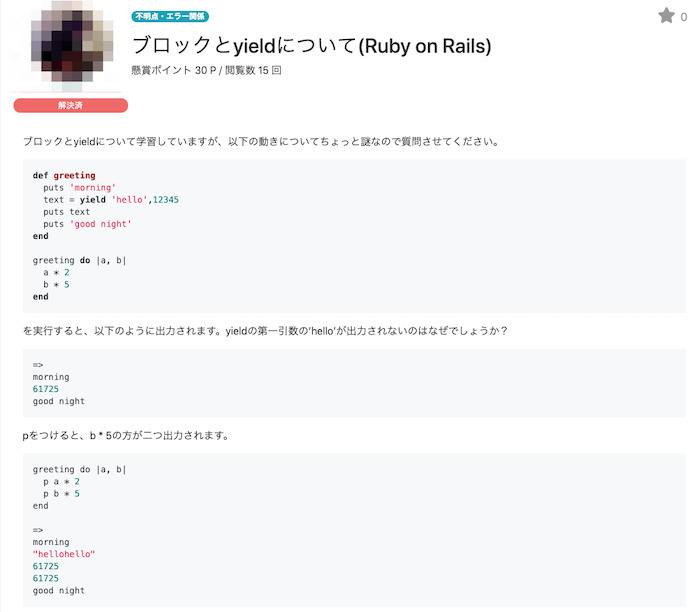
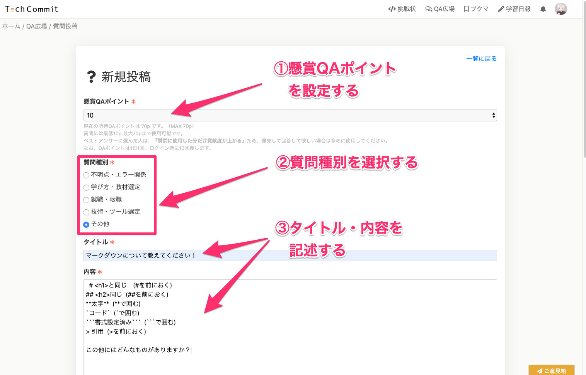
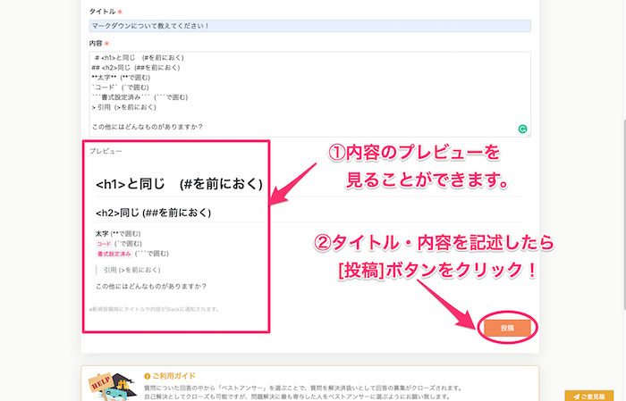
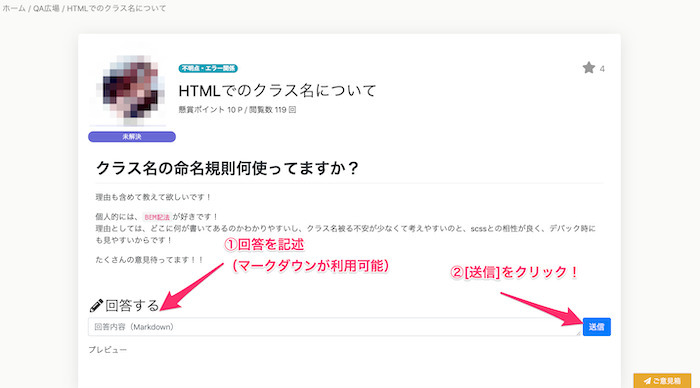
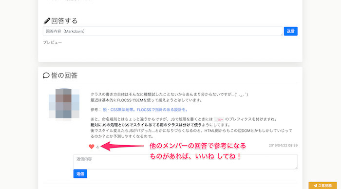
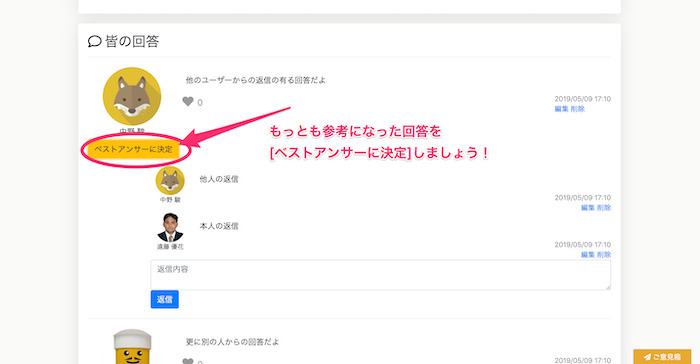
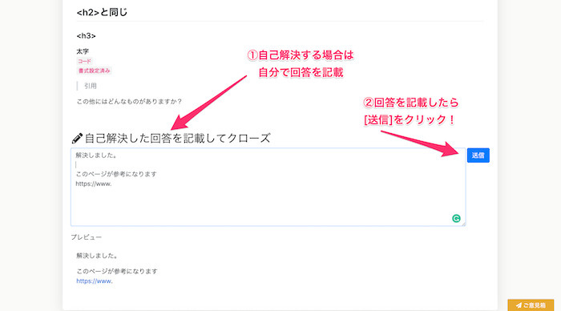

## QA広場とは？
QA広場はメンバー同士で質問や回答が行える機能です。

簡単なゲーミフィケーションの仕組みで「相互扶助」の環境を作成しているため、自分の得意分野や、学んでいる分野での助け合いをしていけるように設置されています。

ひとりで悩まずにみんなで助け合ってエラーや就職などの悩みを解決しましょう！



## QA広場でできること
QA広場の機能には次のようなものがあります。

- 質問の投稿（Slackの[新規質問]チャンネルへ同時投稿されます）
- 質問の回答

QA広場での質問は技術的なものに限らず、オススメの学習教材や勉強方法を聞いてみたり、就職活動前のプロフィールレビュー依頼などにもお使いいただけます。

▼質問例１


▼質問例２


## QA広場の使い方
### 質問を投稿する
質問を投稿するにはQA広場から右側メニューの [質問投稿] をクリックします。


#### 懸賞QAポイントを設定する
QAポイントとは、質問をする時に必要なポイントです。  
最低10ポイント消費することで質問を投稿することが出来ます。

QAポイントは日毎に初めてログインしたときに、『ログインボーナス』として10ポイント加算されます。なお、最大で保有できるのは70までで、超えた分は失効します。

後ほど解答の解説にて詳しく見ていきますが、質問への回答が優先的に欲しい場合、回答者にとって有益に働くため懸賞QAポイントを多めに使って質問をすると良いでしょう。



#### 内容を入力して投稿する
タイトルと内容を記述します。内容にはマークダウンが利用可能です。  
コードを貼り付ける際などには「`」 や「```」で囲むと良いでしょう。

内容入力フォームの下には、プレビューが表示されます。  
入力と確認が終わりましたら、右下の [投稿] ボタンから投稿しましょう！



## 質問に回答する
QA広場では他のメンバーの質問に回答することもできます。

回答は、質問の一覧から質問を選択肢した後の詳細画面下部のフォームから送信することができます。回答にもマークダウンが利用可能です。



他のメンバーの回答で、参考になるものがあれば、ぜひ「いいね」を押してください！  


## 質問を解決済みにする
疑問が解決した場合は質問を解決済みにしてください。  
質問を解決済みにする方法にはベストアンサーを選ぶ方法と、自己解決にする方法の２つがあります。

### ベストアンサーを選ぶ
ある質問に対して満足する回答が得られた場合は、回答に返信した上で、一番参考になった回答をベストアンサーに指定して質問を解決済にしてください。



### 自己解決を選ぶ
質問を投稿した後に、エラーが解決したり自分で情報を見つけた場合は、自己解決をしてください。自己解決は、自分の質問のページの「自己解決した回答を記載してクローズ」の下にあるフォームに回答を記載して[送信]をクリックすることでできます。



## ランキングについて
QA広場には月ごとの貢献度ランキングがあります。

このランキングはベストアンサーに選ばれた回答に設定されていた貢献ポイントと、ついた「いいね」の数などから貢献度を計算して決定されます。

実績機能と連動しているので、自分でも答えられそうなことで困っている方がいれば積極的に回答もつけてあげましょう。

なお、ランキングはQA広場の右上にある[ランキング]からみることができます。

ランキングのポイントのアルゴリズムは以下となっています。

---

（１）ベストアンサーの方に、質問者が使用したQAポイント（懸賞ポイント）分月間貢献値として加算される

（２）回答についたいいねの数×2だけ月間貢献値として加算される（上限10）

上記（１）と（２）は重複します。

またいいねによる貢献値計上は「回答を付けた時点から1ヶ月間」を集計対象とし、翌月のランキング集計の対象となります。

---

## QA広場を「相互扶助」としている理由
技術力のあるITエンジニア方も、殆どの場合「集合知」にはかないません。  
特に様々な技術（インフラやデザインなど）全てに精通している人はまずいません。

また、学習の方法や就職の方法などは立場により答えは様々です。

そこで「ある程度の身内感」の中で、ゲーム要素をきっかけにお互いに助け合える場所を作ろうという考えで設置しているのがこのQA広場になります。

回答があまりつかないものに関しては、メンターの方でも時々フォローをしています。  
※メンターが回答を付け過ぎるとランキング変動が起きづらくなるため、回答がつかないものや、解決が難しそうなもので可能なもののみフォローしています。

なお、環境構築等に関してはそれが進まないとなにも始まらないため、お困りの場合はSlackの[#98_環境構築チャンネル](https://techcommit.slack.com/archives/CJC1AFPLM)もご活用ください。

QA広場の説明は以上です！  
メンバー同士で助け合って、どんどん成長していきましょう！
